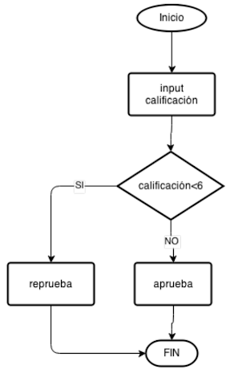

# Algoritmo

## Definición
Es una serie de pasos o instrucciones organizados que permiten alcanzar un fin.

##
- Se deriva del nombre del Matemático Arabe Abu Abdallah Muhammad ibn Musa al-Jwarizmi (Al Juarismi)
- ”First, solve the problem. Then, write the code” –John Johnson
- ”Divide et impera” – Julio César –
- Es importante realizar un algoritmo como base para un programa:
    * Reduce el tiempo de desarrollo
    * simplifica su implementación
    * facilita su depuración y mejoras

\pagebreak

# Generación de un algoritmo

# Consideraciones en la generación de un algoritmo

###
- Puede ser complicado, por lo que requiere cierta práctica.
- En general, hay más de una manera de resolver cualquier problema, la adecuada dependerá de las necesidades particulares.
- Si el problema es muy grande se debe dividir en tareas menos complejas, que después trabajarán en conjunto.
- Un algoritmo puede tener diferentes niveles de detalle, usualmente elegir un punto medio es lo mejor.
- Algunos consideramos un arte este desarrollo (aplicado a la programación) 

\pagebreak

# Ejercicio
## Realizar un algoritmo para doblar una playera/camisa

1. Realizar el algoritmo
2. Intercambiar el algoritmo realizado con un compañero
3. Seguir el algoritmo del compañero para doblar su playera
4. Recibir/dar retroalimentación del algoritmo realizado/hecho
5. Intercambiar algoritmos nuevamente

\pagebreak

# Programación
## Programar 
- Introducir a la computadora las instrucciones necesarias para ejecutar una acción.
- Realizar la implementación de un algoritmo en una computadora.

## Lenguaje de programación
- Herramienta utilizada para dar instrucciones una la computadora

\pagebreak

# Lenguajes de Programación
La computadora trabaja en sistema binario (lenguaje máquina)

## Lenguajes de Bajo nivel
Son más parecidos al lenguaje manejado por la computadora.

## Lenguajes de Alto nivel
Son más parecidos al lenguaje humano.

\pagebreak

# Diagrama de Flujo
Es una representación gráfica de un algoritmo.
Figuras básicas:

Ejemplo:

\pagebreak
# Pseudocódigo
Es una mezcla de lenguaje natural con las convenciones sintácticas de los lenguajes de programación

## Sentencias imperativas
- operaciones: matemáticas, lógicas, de comparación, de bits
- instrucciones de entrada/salida de datos

## Sentencias de selección
- if ... then... else ...

## Sentencias de iteración
- while ...

\pagebreak

# Sentencias imperativas
- operaciones: matemáticas, lógicas, de comparación, de bits
- salida de datos: print
- entrada de datos: input

Ejemplo: 

    print "bienvenido"
    print "ingresa tu nombre"
    input nombre
    print "hola " + nombre

\pagebreak

# Sentencias de selección
Selecciona entre dos o más opciones.

    if <condición> then
        sentencias imperativas
    else
        sentencias imperativas

Ejemplo:

    input calificación
    if calificación < 6 then
        print "reprueba"
    else
       print "aprueba"

\pagebreak
# sentencias de selección reload

    if <condición> then
        sentencias imperativas
    else if <condición> then
        sentencias imperativas
    else
        sentencias imperativas

Ejemplo:

    input calificación
    if calificación < 6 then
        print "reprueba"
    else if calificacion <8 then
        print "pierde la beca"
    else
        print "Estudiante feliz"

\pagebreak
# Sentencias de Repetición

    while <Condición>
        sentencias imperativas

Ejemplo:

    contador = 365
    while contador > 0
        print contador
        espera 1 día
        disminuye contador en 1 (contador-=1)

\pagebreak

# Variables
Cantidad que puede cambiar o que puede tomar uno de diferentes valores

Ejemplos:

- calificación
- edad
- hora
- nombre de archivo

# Ejercicio
Realizar el pseudocódigo para las siguientes condiciones:

Se cuenta con las variables A y B, se requiere intercambiar sus valores. 
a) Utilizando otra variable,
b) Sin usar otra variable
